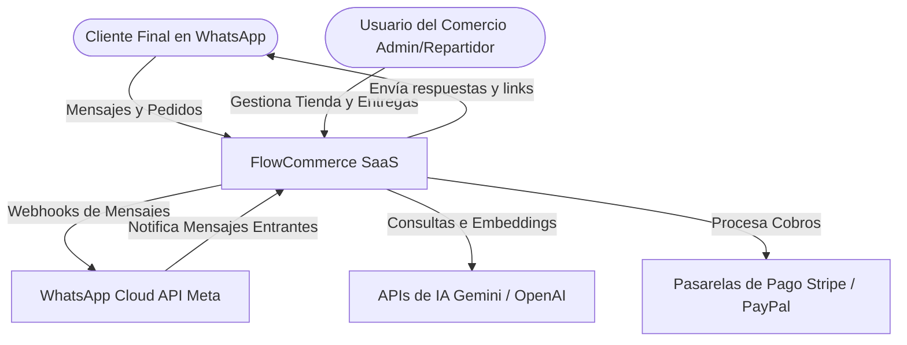
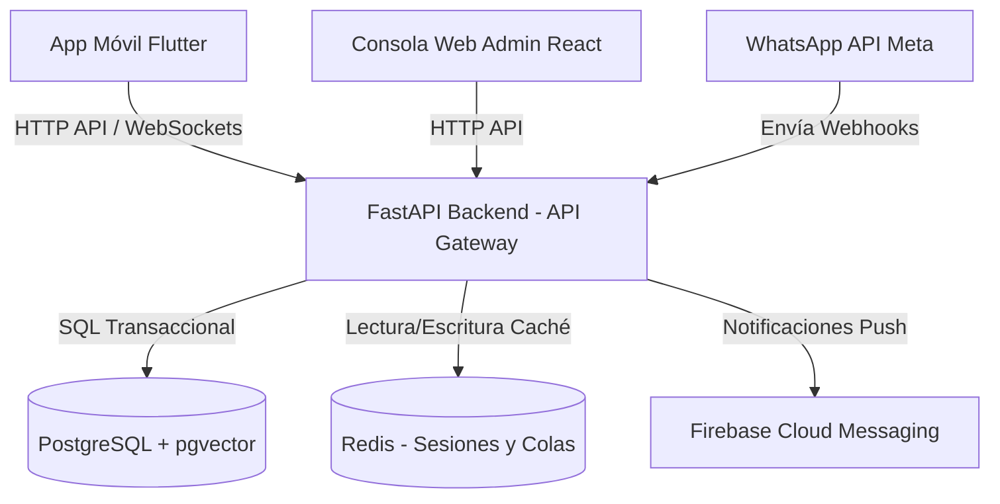
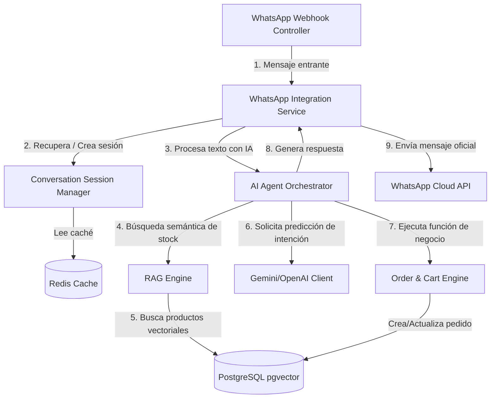

# 03. Arquitectura Empresarial

---

## FASE 6 – ARQUITECTURA EMPRESARIAL (C4 MODEL & DDD)

### 6.1 Bounded Contexts (Domain Driven Design)

Hemos estructurado la plataforma FlowCommerce utilizando **Domain-Driven Design (DDD)** para aislar la lógica de negocio y garantizar la modularidad del código, facilitando la escalabilidad a microservicios si fuera necesario en el futuro.

```
  +-----------------------------------------------------------------------------------+
  |                                 FLOWCOMMERCE DOMAIN                               |
  |                                                                                   |
  |  +--------------------+      +--------------------+      +---------------------+  |
  |  |  Identity Context  |      |   Conversation     |      |  Knowledge Context  |  |
  |  |                    |      |   Context          |      |                     |  |
  |  |  - Tenants         |      |  - Messages        |      |  - Catalogs         |  |
  |  |  - Users           |----->|  - WhatsApp API    |<---->|  - Products         |  |
  |  |  - RBAC            |      |  - Sessions        |      |  - Embeddings (RAG) |  |
  |  +--------------------+      +--------------------+      +---------------------+  |
  |                                        |                            |             |
  |                                        v                            v             |
  |                              +--------------------+      +---------------------+  |
  |                              |    Order Context   |      |   Payment Context   |  |
  |                              |                    |      |                     |  |
  |                              |  - Shopping Cart   |<---->|  - Transactions     |  |
  |                              |  - Orders          |      |  - Gateway Router   |  |
  |                              |  - Status Engine   |      |  - PCI / Security   |  |
  |                              +--------------------+      +---------------------+  |
  |                                        |                                          |
  |                                        v                                          |
  |                              +--------------------+                               |
  |                              |  Delivery Context  |                               |
  |                              |                    |                               |
  |                              |  - Route Tracking  |                               |
  |                              |  - Dispatchers     |                               |
  |                              +--------------------+                               |
  +-----------------------------------------------------------------------------------+
```

1.  **Identity Context (Contexto de Identidad & Acceso):**
    *   *Entidades Principales:* Tenant (Empresa), User (Administrador, Operador, Repartidor), Role, Permission.
    *   *Responsabilidad:* Gestión del ciclo de vida del comercio en el SaaS y control de acceso basado en roles (RBAC) en la consola web y aplicación móvil.
2.  **Conversation Context (Contexto Conversacional):**
    *   *Entidades Principales:* ConversationSession, Message, WebhookEvent.
    *   *Responsabilidad:* Integración bidireccional con WhatsApp Cloud API, gestión del historial de chat de clientes finales y enrutamiento de webhooks.
3.  **Knowledge Context (Contexto de Conocimiento e Inventario):**
    *   *Entidades Principales:* Product, Category, VectorEmbedding, KnowledgeBaseDocument.
    *   *Responsabilidad:* Gestión de catálogos e inventario y su transformación vectorial para alimentar el flujo de búsqueda semántica (RAG) del motor de IA.
4.  **Order Context (Contexto de Órdenes y Pedidos):**
    *   *Entidades Principales:* Order, OrderItem, ShoppingCart, OrderStatusHistory.
    *   *Responsabilidad:* Gestión del carrito de compra conversacional, validación de stock y flujo de estados del pedido.
5.  **Payment Context (Contexto de Pagos):**
    *   *Entidades Principales:* Transaction, PaymentMethod, Refund.
    *   *Responsabilidad:* Integración con pasarelas externas de pago (Stripe, links de cobro, QR) y validación del estado de transacciones.
6.  **Delivery Context (Contexto de Entregas):**
    *   *Entidades Principales:* DeliveryRoute, DeliveryAgent, AddressCoordinate.
    *   *Responsabilidad:* Gestión logística de despacho de pedidos, cálculo de tarifas de envío y tracking en tiempo real para el repartidor.

---

### 6.2 C4 Model

#### Nivel 1: Diagrama de Contexto del Sistema



#### Nivel 2: Diagrama de Contenedores



#### Nivel 3: Diagrama de Componentes (Backend FastAPI)



---

### 6.3 Event Storming (Eventos de Dominio Clave)

El comportamiento de la plataforma está dirigido por eventos, lo que permite un procesamiento reactivo no bloqueante de alta concurrencia.

```
  +------------------+     +--------------------+     +-------------------+
  |  MessageReceived |---->|  SessionResolved   |---->|  InventoryChecked |
  +------------------+     +--------------------+     +-------------------+
                                                            |
                                                            v
  +------------------+     +--------------------+     +-------------------+
  |  DeliveryAssigned|<----|  PaymentProcessed  |<----|  OrderPlaced      |
  +------------------+     +--------------------+     +-------------------+
          |
          v
  +------------------+
  |  OrderDelivered  |
  +------------------+
```

1.  `MessageReceived` (Mensaje Recibido de WhatsApp) -> Desencadena el procesamiento del webhook y lectura de sesión en caché.
2.  `SessionResolved` (Sesión de Conversación Identificada) -> Recupera el prompt del tenant y el historial de chat relevante.
3.  `InventoryChecked` (Inventario Validado por la IA) -> La IA confirma si hay stock disponible del producto consultado mediante Function Calling.
4.  `OrderPlaced` (Pedido Confirmado) -> Genera la orden en base de datos en estado "Pendiente de Pago".
5.  `PaymentProcessed` (Pago Procesado) -> Cambia el estado de la orden a "Pagado" y notifica a la cocina/despacho a través de la consola y app del comercio.
6.  `DeliveryAssigned` (Entrega Asignada al Repartidor) -> Envía las coordenadas y el mapa al dispositivo Flutter del repartidor.
7.  `OrderDelivered` (Pedido Entregado con éxito) -> Cierra el flujo, envía mensaje de agradecimiento al cliente en WhatsApp y archiva la sesión en la base de datos de auditoría.

---

### 6.4 Arquitectura SaaS Multi-Tenant (Aislamiento de Datos)

Para minimizar los costos fijos de infraestructura sin comprometer la seguridad de los datos de las empresas clientes, implementaremos una estrategia de **Base de Datos Compartida con Columnas Discriminadoras y Seguridad a Nivel de Fila (Row-Level Security - RLS)** en PostgreSQL.

#### Justificación Técnica
1.  **Costo Mínimo:** Evita la sobrecarga de mantener múltiples instancias de base de datos (Database-per-tenant) o esquemas independientes (Schema-per-tenant), lo cual dispararía los requerimientos de RAM y CPU de PostgreSQL en nuestro servidor Hetzner de $5 USD.
2.  **Seguridad Robusta:** Postgres RLS nos permite definir políticas de seguridad a nivel de motor de base de datos. Una vez activado, cualquier consulta SQL ejecutada bajo una sesión de tenant específica queda filtrada de forma automática por la columna `tenant_id`, impidiendo fugas de información inter-tenant incluso en caso de bugs a nivel de código de aplicación.
3.  **Mantenibilidad de Migraciones:** Las migraciones de base de datos se ejecutan una única vez sobre el esquema global, simplificando las tareas DevOps y reduciendo el riesgo de esquemas desactualizados entre clientes.

#### Configuración de RLS en Postgres (Ejemplo Conceptual)
```sql
-- Habilitar RLS en la tabla de órdenes
ALTER TABLE orders ENABLE ROW LEVEL SECURITY;

-- Crear política de aislamiento de Tenant
CREATE POLICY tenant_isolation_policy ON orders
    USING (tenant_id = current_setting('app.current_tenant_id'));
```
En el backend, cada conexión a la base de datos establece la variable de configuración de sesión `app.current_tenant_id` con el valor del tenant correspondiente extraído del request de FastAPI, asegurando aislamiento absoluto a nivel de datos.
